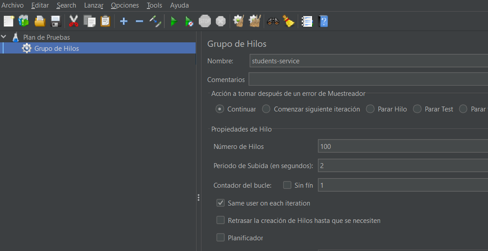
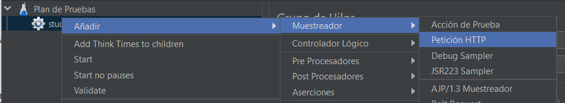
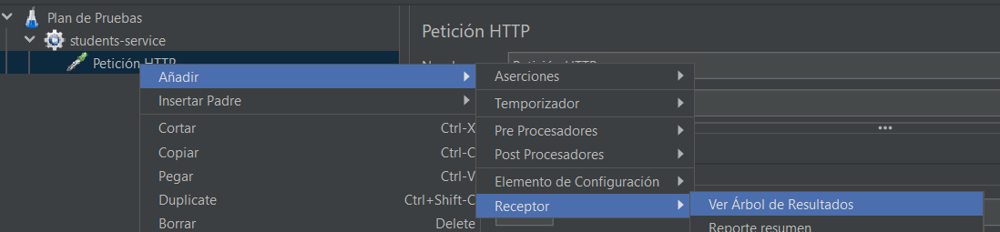

## Práctica 5: Testing en Spring Boot

En esta práctica vamos a realizar un conjunto de tests de diferente tipo para probar nuestra aplicación:

1. Tests unitarios.
2. Tests de integración.
3. Tests de rendimiento.

📌 Para la realización de esta práctica, utiliza ramas en este repositorio. Puedes usar tantas ramas como creas conveniente. Realiza tantos commits como veas necesario. También puedes utilizar PR o cualquier elemento de Git/GitHub. Además, partiremos del código que hicimos en la **práctica 4**.

### Tests unitarios

📢 Los tests unitarios se enfocan en probar una **unidad de código de forma aislada**, generalmente una clase, un método o una función, sin depender de componentes externos como bases de datos, servicios web, etc. En Spring Boot, un test unitario podría involucrar la prueba de un componente específico, como un servicio, un repositorio o un controlador, utilizando mocks para simular el comportamiento de las dependencias externas.


Empezaremos creando los tests unitarios en el proyecto students-service. Para ello, crearemos el fichero **StudentsControllerUnitTest.java** dentro de la carpeta `src/test/java/com.hlc.studentsservice/unit`). Esta clase tendrá, como mínimo, el siguiente contenido:

```
@SpringBootTest
@ExtendWith(MockitoExtension.class)
public class StudentsControllerUnitTest {

    // Mock del repositorio
    @Mock
    private StudentRepository studentRepository;

    // Mock de subjects-service
    @Mock
    private SubjectsClient subjectsClient;

    // Inyectamos los mock anteriores en la clase StudentsController
    @InjectMocks
    private StudentsController studentsController;
}
```

Los primeros tests unitarios que crearemos serán del método `createStudent`:

```
@PostMapping("/students")
public ResponseEntity<String> createStudent(@RequestBody Student student) {
    // Se verifica que los campos requeridos no sean nulos
    if (student.getName() == null || student.getBirthDate() == null || student.getDni() == null) {
        return ResponseEntity.badRequest().body("Fields name, birth_date and dni are required.");
    }

    // Se verifica que la fecha de nacimiento sea pasada
    LocalDate birthDate = LocalDate.parse(student.getBirthDate());
    LocalDate currentDate = LocalDate.now();
    if (birthDate.isAfter(currentDate)) {
        return ResponseEntity.badRequest().body("Field birth_date must be a past date.");
    }

    // Se crea el estudiante en bd
    Student persistedStudent = studentRepository.save(new Student(student.getName(), student.getBirthDate(), student.getDni()));

    return ResponseEntity.status(HttpStatus.CREATED).body(persistedStudent.toString());
}
```

Como vemos, este método crea un estudiante en BD pero antes comprueba que los campos no sean null y que la fecha de nacimiento no sea futura. Por lo cual, como mínimo deberemos crear los siguientes tests unitarios:
1. **Test positivo** para comprobar que el objeto estudiante se crea correctamente.

```
@Test
void testCreateStudent_Success() {
    // Se configura el comportamiento del mock
    Student student = new Student("John", "2000-01-29", "12345678A");
    when(studentRepository.save(any(Student.class))).thenReturn(student);

    // Se realiza la llamada al método
    ResponseEntity<String> response = studentsController.createStudent(student);

    // Se verifica la respuesta
    Assertions.assertEquals(HttpStatus.CREATED, response.getStatusCode()); // Verifica que la respuesta es OK
    Assertions.assertTrue(response.getBody().equals(student.toString())); // Verifica que la respuesta se corresponde con el objeto creado
    verify(studentRepository, times(1)).save(any(Student.class)); // Verifica que se llama al método save del repositorio una vez
}
```
2. **Test negativo** para comprobar que si alguno de los campos es null, se devuelve un mensaje de error.

```
@Test
void testCreateStudent_MissingRequiredFields() {
    Student student = new Student(); // Student sin campos obligatorios

    ResponseEntity<String> response = studentsController.createStudent(student);

    Assertions.assertEquals(HttpStatus.BAD_REQUEST, response.getStatusCode());
    Assertions.assertTrue(response.getBody().contains("Fields name, birth_date and dni are required.")); // Verifica que la respuesta contiene el mensaje de error esperado
    verify(studentRepository, never()).save(any(Student.class)); // Verifica que no se llama al método save del repositorio
}
```
3. **Test negativo** para comprobar que si el campo birth_date contiene una fecha futura, se devuelve un mensaje de error.

```
@Test
void testCreateStudent_FutureBirthDate() {
    Student student = new Student("Alice", "2100-01-01", "87654321B"); // Fecha de nacimiento en el futuro

    ResponseEntity<String> response = studentsController.createStudent(student);

    Assertions.assertEquals(HttpStatus.BAD_REQUEST, response.getStatusCode());
    Assertions.assertTrue(response.getBody().contains("Field birth_date must be a past date.")); // Verifica que la respuesta contiene el mensaje de error esperado
    verify(studentRepository, never()).save(any(Student.class)); // Verifica que no se llama al método save del repositorio
}
```

Al ejecutar los tests debería mostrarse que se han lanzado correctamente:


💡 Crea los tests unitarios necesarios para el resto de métodos que has implementado, así como para el microservicio subjecs-service. **¿Necesitamos crear tests unitarios para discovery-service?**

### Tests de integración

📢 Los tests de integración prueban **cómo interactúan múltiples componentes o sistemas en conjunto**, incluyendo sus integraciones con bases de datos, servicios externos, etc.
En Spring Boot, un test de integración podría involucrar la configuración de un contexto de aplicación más completo, incluyendo la configuración de base de datos en memoria o la configuración de servicios web reales.

Generalmente, hay dos enfoques comunes para escribir tests de integración:

* **Test de integración real**: En este enfoque, se realiza una llamada real al sistema bajo prueba y se verifica la respuesta real del sistema. Este enfoque proporciona una validación más completa del comportamiento del sistema, ya que todas las capas y componentes interactúan como lo harían en producción. Sin embargo, puede ser más lento y dependiente de recursos externos, como bases de datos o servicios externos.

* **Test de integración con mocks parciales**: En este enfoque, se utilizan mocks para simular ciertos componentes o capas del sistema, mientras que otras partes del sistema interactúan de forma real. Por ejemplo, puedes usar un mock para simular una capa de servicio o un repositorio, mientras que la llamada HTTP real se realiza al controlador. Este enfoque puede ser más rápido y más controlado, ya que se pueden simular diferentes condiciones y respuestas del sistema. Además, permite aislar la prueba de dependencias externas, como bases de datos o servicios externos, lo que puede ser útil en entornos de pruebas más complejos.

Para crear nuestros tests de integración, en primer lugar, hay que crear el fichero **StudentsControllerIntegrationTest.java** dentro de la carpeta `src/test/java/com.hlc.studentsservice/integration`.
Al igual que antes, crearemos los tests de integración para el método `createStudent`, ya que interactúa con un componente externo: la base de datos. Para este ejemplo optaremos por el enfoque de mocks parciales:

```
@ExtendWith(SpringExtension.class)
@SpringBootTest
@AutoConfigureMockMvc
public class StudentsControllerIntegrationTest {

    @Autowired
    private MockMvc mockMvc;

    @MockBean
    private StudentRepository studentRepository;

    @Test
    void testCreateStudent() throws Exception {
        // Se configura el comportamiento del mock del repositorio
        Student student = new Student("John", "2000-01-29", "12345678A");
        when(studentRepository.save(any(Student.class))).thenReturn(student);

        // Se realiza la solicitud POST al endpoint /students
        String studentJson = "{\"name\": \"John\", \"birthDate\": \"2000-01-29\", \"dni\": \"12345678A\"}";
        mockMvc.perform(MockMvcRequestBuilders.post("/students")
                        .contentType(MediaType.APPLICATION_JSON)
                        .content(studentJson))
                .andExpect(status().isCreated());
    }
}
```


🔎 Si te fijas, el test de integración que acabamos de crear es muy similar a los tests unitarios del apartado anterior. La principal diferencia es que en el test unitario no hay interacción con el contexto de Spring Boot ni con el sistema de manejo de peticiones HTTP, mientras que en el test de integración se interactúa con el controlador y el sistema de manejo de solicitudes HTTP de manera más completa.


💡 **¿Para qué otros casos de nuestra aplicación necesitamos crear tests de integración?** Analízalo y si falta alguno, créalo (también en subjects-service).

✨ **¿Cómo limpiarías el código de estos tests?** Piensa en qué objetos deberían estar dentro de constantes o qué funciones deberían estar en métodos independientes que puedan reutilizarse y aplica esos cambios a tus tests.

### Tests de rendimiento

📢 Los tests de rendimiento tienen como objetivo principal medir cómo responde el sistema en términos de velocidad, capacidad, estabilidad y escalabilidad cuando se somete a diferentes niveles de carga. Se miden parámetros como el tiempo de respuesta o la tasa de transferencia.

Para nuestros tests de rendimiento usaremos **JMeter**, una herramienta desarrollada para realizar tests de carga. En nuestro ejemplo testearemos el siguiente método de students-serivce:

```
@GetMapping("/example")
public List<Student> getExampleStudents() {
    return Arrays.asList(
            new Student("1", "John", "29/01/2000", "12312312A"),
            new Student("2", "Alice", "12/04/2003", "87654321B"));
}
```

Los pasos para crear el test son los siguientes:

1. Descarga JMeter de su página oficial: https://jmeter.apache.org/download_jmeter.cgi
2. En la carpeta descargada, entra en `/bin` y ejecuta el archivo `jmeter.sh`.
3. Una vez abierto el programa, creamos un grupo de hilos:


4. Añadimos la siguientes configuración (presta atención especialmente al número de hilos):



5. Añadimos un muestreador de petición HTTP y la configuramos:




6. Añadimos el árbol de resultados para verlos tras la ejecución del test:



7. Por último, ejecutamos el test y pulsamos en el árbol de resultados. Podemos observar que todas las peticiones se han realizado correctamente:


Con esta información podemos concluir con que el programa soporta como mínimo 100 peticiones concurrentes.

💡 Modifica el número de hilos hasta encontrar el punto en el que el servicio **no puede soportar** más peticiones concurrentes.
